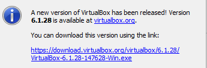

1. При каждом развертывании получаем один и тот же результат, устранение дрейфа конфигураций, ускорение и автоматизация создания окружений.  Идемпотентность.
2. Не нужно устанавливать агенты на конфигурируемые машины.  Push, потому что при ошибках применения конфигураций на любой машине, процесс будет остановлен, или будет явное сообщение об ошибке.
3.   
`vagrant version` 
`Installed Version: 2.2.18` 
`Latest Version: 2.2.19`   
`ansible --version` 
`ansible 2.9.6`